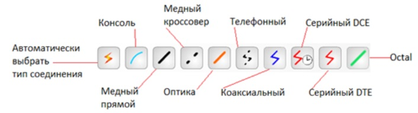

# МЕТОДИЧЕСКИХ РЕКОМЕНДАЦИЙ ПО КУРСУ «ОСНОВЫ СЕТЕВЫХ ТЕХНОЛОГИЙ»	

Содержание

[Применение Cisco Packet Tracer в учебном процессе](#title1)

[Тема «Классификация компьютерных сетей»](#title2)

[Физическое перемещение устройства](#title3)

[Тема «Топологии компьютерных сетей»](#title4)

[Подключение устройств](#title5)

[Статус подключения](#title6)

[Создание топологий](#title7)

[Тема «Сетевое оборудование»](#title8)

[Маршрутизаторы](#title9)

[Коммутаторы](#title10)

[Другие устройства](#title11)

[Подключение модулей сетевых устройств](#title12)

[Система наименования модулей](#title13)

[Тема «Маршрутизация в компьютерных сетях»](#title14)

[Настройка статической маршрутизации](#title15)

[Динамическая маршрутизация](#title16)

[Тема «Беспроводные сети»](#title17)

[Настройка статических IP-адресов](#title18)

[Выполнение подключения к беспроводной сети на рабочей станции ПК1](#title19)

[Тема «Настройка DHCP сервера с помощью Cisco Packet Tracer»](#title20)

[Изучить динамический метод распределения IP-адресации.](#title21)

## <a id="title1">Применение Cisco Packet Tracer в учебном процессе </a>
Симулятор Cisco Packet Tracer в полной мере подходит для организации учебного процесса на практических занятиях. Возможность создания в виртуальной среде отдельных кабинетов в зданиях позволяет осуществлять моделирование как локальных сетей, реализовать на одной рабочей области большое количество различных сегментов сети, что облегчает визуальное восприятие всей модели создаваемой сетевой инфраструктуры.

Возможности использования программного продукта Cisco Packet Tracer при изучении всех тем связанных непосредственно с компьютерными сетями, в качестве альтернативы реальному оборудованию, используемому при построении компьютерных сетей.

Рассмотрим использования комплекса Cisco Packet Tracer при изучении каждой темы предмета: «Информатика».

## <a id="title2">Тема «Классификация компьютерных сетей» </a>
**Цель работы:** изучение таких понятий, как локальные, глобальные компьютерные сети. Физическое рабочее пространство.

**Краткая теория**

Реализованная возможность создания в Cisco Packet Tracer кабинетов в зданиях прекрасно подходит для визуальной демонстрации различий данных сетей и взаимодействий между ними. Реализованный режим Simulation позволяет визуально показать процесс перемещения пакетов между устройствами посредством компьютерной сети. Данная особенность позволяет наиболее наглядно продемонстрировать обучающимся работу широковещательной сети.

Физическое рабочее пространство делает вашу логическую топологию более осязаемой, придавая ей физическое измерение. Физическое рабочее пространство имеет четыре различных типа сред: междугородное окружение, город, здание и телекоммуникационный шкаф. 

Междугородное окружение (Intercity). Самый масштабный вид среды, состоящее из городов. Города, здания и телекоммуникационные шкафы могут быть добавлены на этом уровне с использованием контрольной панели. 

Рисунок 1. Междугородное окружение

Города (Cities). Этот слой включает здания и телекоммуникационные шкафы. По умолчанию город называется «Домашний город» (Home City). Домашний город может быть передвинут и размещен в любом месте междугородной карты. 

Рисунок 2. Город

Здания (Buildings). Этот слой содержит телекоммуникационные шкафы. По умолчанию называется «Корпоративный офис» (Corporate Office). 

Рисунок 3. Здание

Телекоммуникационный шкаф (Wiring closet). Последний слой содержит устройства, размещенные в логической топологии. Его стандартное название «Главный телекоммуникационный шкаф» (Main Wiring Closet) и не имеет никаких других подразделений. 

### <a id="title3"> Физическое перемещение устройства </a>
Все устройства, задействованные в логическом пространстве, размещаются в главном телекоммуникационном шкафе. В этом разделе мы изучим как перемещать их.
Создайте схему сети в логическом рабочем пространстве, состоящую из двух компьютеров. Соедините компьютеры между собой кабелем. 

Рисунок 4. Соединение ПК

Переключитесь на физический вид и нажмите кнопку «Новый город» (New City) на панели инструментов. Переименуйте вновь созданный город, например, дайте ему имя Удаленный город (Remote City). Затем откройте город и создайте в нем новое здание, а в нем создайте новый телекоммуникационный шкаф. 

Используя кнопку «Навигация» (Navigation), перейдите к главному телекоммуникационному шкафу Home City→ Corporate Office→ Main Wiring Closet. В нем находятся оба ПК, которые мы разместили на логическом рабочем пространстве.

Рисунок 5. Меню навигации

Используя кнопку «Переместить объект» (Move Object) (или клавиатурное сокращение Shift+M), а затем кликните на любом ПК и переместите его в «Удаленный город» Remote City→ Office Building→Wiring Closet. Эту операцию можно также осуществить в окне навигации перетаскиванием объекта.  

Рисунок 6. Меню навигации с перемещенным ПК

Перейдите на междугородный уровень и вы увидите связь между Удаленным и Домашним городами. Вернитесь в логическое рабочее пространство и вы обнаружите, что изменения, внесенные на физическом плане, не оказывают никакого влияния на топологию сети.  

Устройства в физическом рабочем пространстве могут быть перемещены на любой уровень: междугородный, городской, здание и телекоммуникационный шкаф. При этом их изображения буду находится в соответствующем физическом окружении. 

Рисунок 7. Соединение городов

На физическом плане может быть определена информация о длине кабеля и расстоянии между устройствами. Такая возможность очень востребована для размещения беспроводных устройств. Измерение длины кабеля производится размещением указателя мыши над кабелем.

Рисунок 8. Расстояние между городами

## <a id="title4">Тема «Топологии компьютерных сетей»</a>

**Цель работы:**  Разобраться как создавать топологию сети, как подключать устройства и отслеживать состояние линий связи.

**Краткая теория**

Для обеспечения наибольшей наглядности и наиболее полного понимания изучаемых объектов и процессов также необходимо использование специального оборудования: сетевые кабели, коннекторы, коммутаторы (switch), концентраторы (hub) и т. д. 

Необходимы и свободные персональные (стационарные) компьютеры или ноутбуки для объединения их в сеть. Причем, очевидно, требуется несколько комплектов такого оборудования, чтобы в построении сети мог участвовать индивидуально каждый школьник либо небольшие группы школьников. Программа Cisco Packet Tracer обладает всем необходимым набором компонентов для демонстрации соединения оборудования в различных топологиях.

### <a id="title5">Подключение устройств</a>

При выборе категории «Подключения (Connection)» в окне выбора устройств, можно заметить несколько типов кабелей в окне выбора конкретного типа кабеля. 

Рисунок 9. Выбор подключения

Cisco Packet Tracer поддерживает следующие типы кабелей, которые могут быть использованы для соединения устройств. 

**Консольное подключение (Console).** Консольной кабель используется для подключения к сетевому устройству и последующей настройки с помощью ПК или ноутбука. Один конец кабеля подключается к консольному порту сетевого оборудования, другой конец к порту RS-232 ПК или ноутбука. 

**Прямой кабель (Copper straight-through).** Этот тип кабеля является стандартным Ethernet-кабелем для соединения двух устройств, работающих на разных уровнях модели OSI (разноранговых, таких как хаб и маршрутизатор, ПК и коммутатор). Может быть использован при подключении к Ethernet, Fast Ethernet и Gigabit Ethernet портам. Данный тип кабеля имеет аналог в реальном мире – витая пара UTP.

**Перекрестный кабель (Copper straight-through).** Используется для подключения одноранговых устройств (работающих на одном и том же уровне модели OSI, таких как хаб к хабу, ПК к ПК, ПК к маршрутизатору, ПК к принтеру), а также при подключении коммутатора и хаба. Данный тип кабеля также используется при подключении к Ethernet, Fast Ethernet и Gigabit Ethernet портам. Имеет аналог в реальном мире – витая пара UTP с перекрестным подключением. 

**Оптоволокно (Fiber).** Предполагает подключение к оптическим Ethernet, Fast Ethernet и Gigabit Ethernet портам. 

**Телефонный кабель (Phone).** Кабель предназначен для подключения аналогового телефона с разъемом RJ-11 к VoIP-телефону или к модему. Также может использоваться к подключения к модемному порту маршрутизатора.

**Коаксиальный кабель (Coaxial).** Коаксиальный кабель используется для подключения кабельного модема ил телевизора к облаку. 

**Кабель с DCE.** Последовательный кабель соединяет маршрутизаторы друг с другом или с облаком.

**Консольный кабель-концентратор (Octal).** Данный тип кабеля появился впервые в шестой версии Packet Tracer. Предполагает подключение на одной стороне к одному консольному порту, на другой стороне имеет восемь окончаний с RJ-45 разъемом. 

**Автоматический выбор типа подключения.** Если вы затрудняетесь с необходимым типом кабеля, выбирайте эту опцию и программа автоматически определить наилучший вариант тип подключения. Наилучший тип подключения гарантируется не всегда. В частности, если у вас есть маршрутизатор с последовательным и Ethernet интерфейсами, и вы выбрали именно эту опцию подключения, однако вначале будет выбрано только последовательное подключение (что разумеется не лучший вариант). Также консольное подключение не может быть выбрано автоматически, и требует целенаправленного выбора консольного кабеля.  

### <a id="title6">Статус подключения</a>

После подключения устройств вы обнаружите цветовую индикация на каждом конце кабеля, которая отображает статус подключения.  

Зеленый цвет говорит о том, что физическое соединение работает, но ничего не говорит работоспособности протокола канального уровня. 

Зеленый мигающий отображает активность интерфейса при передаче данных. 

Красный сообщает о том, что физическое соединение не работает. Это может быть по причине выбора неправильного типа кабеля или при административном выключении порта (командой shutdown). 

Янтарный имеет место у коммутаторов и отображает работу порта в соответствии с протоколом связующего дерева STP (Spanning Tree Protocol) по определению резервных связей второго уровня. Продемонстрируем это на примере топологии, содержащей ПК, ноутбук, коммутатор и маршрутизатор.

Рисунок 10. Индикация подключения

### <a id="title7">Создание топологий</a>

При создании топологий большого размера можно столкнуться с ситуацией, когда становиться трудно что-либо понять или отследить. В таком случае выручает группировка (кластеризация) некоторых устройств, обеспечивающая объединение этих устройств в одиночное облачное представление. При двойном клике на облаке оно будет раскрываться и отображать сгруппированные устройства в обычном представлении. 

Давайте посмотрим как создается кластер устройств. 

В качестве примера воспользуемся следующей топологией, содержащей 3 коммутатора и 9 ПК (Рис. 11). И хотя эта схема не сильно загромождена, но послужит для демонстрации принципов кластеризации, как следует поступать при будущих затруднениях. 

Рисунок 11. Исходный пример для группировки устройств 

Кликните в чистом месте около ПК0 и протяните мышкой для выделения ПК0-ПК2 и коммутатора Switch0. Затем нажмите кнопку «Новый кластер» (New Cluster), расположенную над рабочим пространством. При этом выделенные устройства будут объединены в кластер. 

Рисунок 12. Создание кластера

Повторите эти действия для двух оставшихся групп из трех компьютеров и коммутатора. 

В итоге наша топология после группировки будет выглядеть следующим образом.

Рисунок 13. Итоговая схема после кластеризации

Двойной щелчок по кластеру развернет группу и покажет только устройства, входящие в него. Для того, чтобы вернуться назад в рабочее пространство следит нажать кнопку «Назад» (Back).

Кластеризация также может быть использована для группировки и сокрытия подробностей внешних устройств. Следует заметить, что кластеризация имеет отношение к логическому рабочему пространству и не оказывает влияния на отображение устройств в физическом рабочем пространстве. 

## <a id="title8">Тема «Сетевое оборудование»</a>

**Цель работы:**  Узнать информацию о всех сетевых устройствах, доступных в Packet Tracer, и модулях, подходящих для конкретных моделей устройств.

**Краткая теория**

Для полноценной работы необходимо несколько видов оборудования каждого класса: сетевые кабели, устройства коммутации, маршрутизаторы, устройства для проводного и беспроводного соединения и т.д. Даже если образовательная организация имеет финансовую возможность приобрести все необходимое оборудование, то по естественным причинам возникает проблема его физического размещения в учебных аудиториях. 

Здесь использование среды имитационного моделирования становится целесообразнее использования реальных устройств. Среда Cisco Packet Tracer позволяет смоделировать работу достаточного количества сетевого оборудования. 

В самой программе хорошо реализовано распределение оборудования по классам для более быстрого поиска. Так, для пользовательских устройств и серверов создан блок End Devices. Все виды маршрутизаторов, коммутаторов, концентраторов, беспроводных устройств расположены в блоке Network Devices. 

Различные типы соединительных кабелей находятся в блоке Connections. Кроме того, в каждом блоке устройства дополнительно классифицируются по типу и назначению.

### <a id="title9">Маршрутизаторы</a>

Маршрутизаторы обеспечивают взаимодействие между подсетями (логическими сегментами). Любой маршрутизатор в Packet Tracer может быть включен и выключен переключением тумблера «Питание», расположенного на внешнем виде устройства («Physical Device View»).

Рисунок 14. Вкладка «Физический вид устройства»

Возможность включения/выключения питания маршрутизаторов в Packet Tracer симулирует работу реальных устройств. Модуль устрой-ства может быть добавлен и удален только после выключения электропитания устройства. При этом надо помнить, если вы не сохранили текущую конфигурацию, выключение устройства приведет к потере произведенных настроек.

Следующие маршрутизаторы доступны в Packet Tracer:
+ **Cisco 1841.** Маршрутизатор с интегрированными сервисами, имеет два порта Fast Ethernet и два свободных слота для подключения интегральных карт для высокоскоростного WAN-соединения.
+ **Cisco 1941.** Эта модель подобна предыдущей с той лишь разницей, что функционирует под управление 15 версии Cisco IOS. Также имеет два Gigabit Ethernet порта.
+ **Cisco 2620XM.** Этот мультисервисный маршрутизатор имеет один Fast Ethernet порт, два слота для установки WAN интерфейсных карт.
+ **Cisco 2621XM.** Данный маршрутизатор подобен предыдущему, за исключением наличия двух портов Fast Ethernet.
+ **Cisco 2811.** Маршрутизатор с интегрированными сервисами имеет два порта Fast Ethernet, четыре WIC слота и два AIM слота.
+ **Cisco 2901.** Этот маршрутизатор имеет два Gigabit Ethernet порта, четыре WIC слота и два слота для установки DSP.
+ **Cisco 2911.** Данный маршрутизатор имеет три порта Gigabit Ethernet, а в остальном повторяет характеристики предыдущего устройства. Функционирует под управлением 15 версии Cisco IOS.
+ **Genetic Router-PT.** Маршрутизатор с настройкой под пользователя. Имеет 10 слотов и несколько специальных модулей.

Рисунок 15. Панель маршрутизаторов

### <a id="title10">Коммутаторы</a>

Коммутатор (ранее называемые многопортовый мост) соединяет более чем одно оконечное устройство в сеть. Каждый порт коммутатора является коллизионным доменом. 

Следующие коммутаторы доступны в Packet Tracer:
+ **Cisco 2950-24.** Управляемый коммутатор с поддержкой 24 портов Fast Ethernet.
+ **Cisco 2950T-24.** Этот коммутатор принадлежит к семейству интеллектуальных коммутаторов Catalyst 2950 и имеет 24 порта Fast Ethernet и два Gigabit Ethernet 
+ **Cisco 2960-24TT.** Еще один 24-портовый коммутатор. В отличие от предыдущей модели имеет порты Gigabit Ethernet.
+ **Cisco 3560-24PS.** В отличие от других коммутаторов данное устройство является коммутатором 3 уровня и в дополнении к штатной функции коммутации способно осуществлять маршрутизацию. Две последние буквы PS означают поддержку питания по Ethernet PoE (Power over Ethernet), что используется для питания IP-телефонов без отдельного блока питания.
+ **Bridge PT.** Это устройство используется для сегментации сетей и имеет только два порта (потому и называется мостом; если бы портов было больше, тогда более приемлемое название было бы коммутатор).
+ **Generic Switch PT.** Данное устройство существует только в Packet Tracer и представляет собой коммутатор с настройкой под пользователя. Имеет 10 слотов и несколько специализированных модулей.

Точно также как рассмотренный ранее Genetic Router-PT, коммутатор ) Generic Switch PT может быть выключен, что необходимо для смены модулей. 

Рисунок 16. Панель коммутаторов

### <a id="title11">Другие устройства</a>

Как можно убедиться, Packet Tracer поддерживает не только коммутаторы и маршрутизаторы, но и другие устройства. 

**Hub PT.** Построение сетей на основе концентраторов является достоянием истории. Однако с помощью этого устройства становится возможным познакомиться с широковещательным штормом и коллизиями. Имеет 10 слотов.

**Repeater.** Используется для повышения уровня и восстановления формы электрического сигнала. Имеет два слота.

**Coaxial Splitter PT.** Предназначено для раздвоения коаксиального подключения. Имеет три порта для подключения коаксиального кабеля и не может быть кастомизирован.

Рисунок 17. Панель хаб устройств

### <a id="title12">Подключение модулей сетевых устройств</a>

Модули сетевых устройств представляют собой аппаратную реализацию некоторый распространённых интерфейсов. Например, модуль HWIC-4ESW содержит 4 Ethernet-порта (10 Мбит/с). Как и для реального устройства, так и для устройства, представленного в Packet Tracer, для замены модуля требуется отключение питания.

Для отключения питания сделайте один клик на переключателе питания в правой части устройства. Для установки модуля перетащите любой из доступных в списке модулей и установите его в любой пустой слот. Если модуль не может быть установлен в определенный слот, то он будет автоматически возвращен в список.

Рисунок 18. Смена сетевых модулей

Для удаления модуля также необходимо выключить питание и перетащить его из слота обратно в список.

### <a id="title13">Система наименования модулей</a>

Каждый маршрутизатор имеет более десятка модулей, которые могут быть идентифицированы по их названиям. 

**Медный интерфейс Ethernet.** Представляет собой стандартные LAN-интерфейс, к которому подключается медная витая пара с разъемом RJ-45. Название таких интерфейсов основано на указании скорости: Ethernet (10 Мбит/с), Fast Ethernet (100 Мбит/с), Gigabit Ethernet (1000 Мбит/с). Соответственно в названиях модулей имеется сокращенное упоминание об скорости интерфейса: E, FE, GE, CFE или CGE. Модули с обозначение SW предназначены для маршрутизаторов и обеспечивают функции коммутации.

Рисунок 19. Медный интерфейс Ethernet

**Оптический модуль Ethernet.** Данный вид модулей схож с предыдущим, за исключением использования оптического кабеля вместо медного. Эти модули можно определить по присутствующей букве F.

Рисунок 20. Оптический модуль Ethernet

**Последовательный интерфейс.** В названиях этих модулей присутствует буква T или пара символов A/S. Модули с буквой T являются синхронными, а модули с символами A/S – асинхронными. Различия в их работе проявляется в мире реального оборудования, в Packet Tracer между ними нет разницы.

Рисунок 21. Последовательный интерфейс

**Модемный интерфейс.** Данный вид модулей имеет RJ-11 интерфейс для подключения телефонных кабелей. Такие модули можно идентифицировать по буквам AM, присутствующих в названии после цифры, указывающей количество портов.

Рисунок 2.22. Модемный интерфейс
Модули с поддержкой WIC-модулей. Сетевые модули WIC не занимают слот целиком, для их поддержки используются модули (WICs within Network Modules(NM)), имеющие в своем составе дополнительные слоты для поддержки модулей малого размера. Такие модули можно опознать по букве W, присутствующей в конце названия.

Рисунок 2.23. Модемный интерфейс
Заглушки. Packet Tracer обеспечивает заглушку (крышку) для пустых слотов. Заглушка не несет никакой функциональной нагрузки и служит для более приятного вида устройства при просмотре физического вида устройства.

Рисунок 2.24. Заглушка

2.5. Тема «Маршрутизация в компьютерных сетях»
Цель работы: изучить составление сетевых маршрутов для объединение разных подсетей.
Краткая теория
У учащихся возникают определенные сложности как с пониманием теоретической части, так и с недостаточной наглядностью самого процесса передачи пакетов между подсетями. В некоторых случаях достаточно объяснения процесса «на пальцах», но все же, как показала практика, у большей части обучающихся без достаточной наглядности процесс понимания проходит достаточно медленно. Конечно, в операционных системах есть специальные утилиты для проверки маршрута до конкретного адреса. Но, используя их, можно посмотреть только промежуточные точки[11].
Одна из главных задач маршрутизатора состоит в определении наилучшего пути к заданному адресату. Маршрутизатор определяет пути (маршруты) к адресатам или из статической конфигурации, введенной администратором, или динамически на основании маршрутной информации, полученной от других маршрутизаторов. Маршрутизаторы обмениваются маршрутной информацией с помощью протоколов маршрутизации.
Маршрутизатор хранит таблицы маршрутов в оперативной памяти. Таблица маршрутов это список наилучших известных доступных маршрутов.
Маршрутизатор использует эту таблицу для принятия решения куда направлять пакет.
В случае статической маршрутизации администратор вручную определяет маршруты к сетям назначения. В случае динамической маршрутизации – маршрутизаторы следуют правилам, определяемым протоколами маршрутизации для обмена информацией о маршрутах и выбора лучшего пути.
Статические маршруты не меняются самим маршрутизатором. Динамические маршруты изменяются самим маршрутизатором автоматически при получении информации о смене маршрутов от соседних маршрутизаторов. Статическая маршрутизация потребляет мало вычислительных ресурсов и полезна в сетях, которые не имеют нескольких путей к адресату назначения. Если от маршрутизатора к маршрутизатору есть только один путь, то часто используют статическую маршрутизацию[18].

2.5.1. Настройка статической маршрутизации
При статической маршрутизации требуется немалая ручная работа. Так если один маршрутизатор добавляется (или удаляется) из сети, на всех оставшихся должно быть проведено ручное обновление этих изменений.
Проведем настройку статической маршрутизации с помощью графических мастеров интерфейса Cisco Packet Tracer. Создадим схему сети (рис. 2.21).

Рисунок 2.25. Схема сети
Создадим две сети, в каждой из них подключен DHCP сервер. Задачи настроить статические таблицы маршрутизации на роутере и проверить работоспособность сети.
Приступим к настройке статической маршрутизации на роутере. Для этого войдите в конфигурацию маршрутизатора, в интерфейсах включить порты и установите IP адрес и маску подсети. Затем в разделе МАРШРУТИЗАЦИЯ откройте вкладку СТАТИЧЕСКАЯ, внесите данные (рис.2.22) и нажмите кнопку ДОБАВИТЬ:

Рисунок 2.26. Схема сети
Чтобы посмотреть полную настройку таблицы маршрутизации, выберите в боковом графическом меню инструмент ПРОВЕРКА (пиктограмма лупы), щелкните в схеме на роутере и выберите в раскрывающемся меню пункт ТАБЛИЦА МАРШРУТИЗАЦИИ.
После настройки всех роутеров в вашей сети станут доступны IP адреса любого компьютера и вы сможете получить доступ к любому из них.

2.5.2. Динамическая маршрутизация
При изучении статической маршрутизации мы столкнулись с большим объемом ручной работы. При этом изменения в топологии сети также требует внесение изменений в настройки вручную. Динамические протоколы маршрутизации позволяют обеспечить автоматическое оповещение каждого маршрутизатора о существующих маршрутах.
Статическая маршрутизация не подходит для больших, сложных сетей потому, что обычно сети включают избыточные связи, многие протоколы и смешанные топологии.
Маршрутизаторы в сложных сетях должны быстро адаптироваться к изменениям топологии и выбирать лучший маршрут из многих кандидатов. IP сети имеют иерархическую структуру. С точки зрения маршрутизации сеть рассматривается как совокупность автономных систем. 
В автономных подсистемах больших сетей для маршрутизации на остальные автономные системы широко используются маршруты по умолчанию.
При динамической маршрутизации таблица маршрутизации заполняется и обновляется автоматически при помощи протоколов маршрутизации — OSPF, RIP, EIGRP. 
Основные параметры выбора протокола динамической маршрутизации: 
• размер сети; 
• совместимость между моделями маршрутизаторов; 
• требования к знаниям администраторов. 
Когда маршрутизаторы не успевают синхронизировать свои таблицы, то это приводит к противоречивым сведениям о топологии сети в различных её частях и потере передаваемых данных из-за дополнительной нагрузки динамической маршрутизации на устройства. 
2.6. Тема «Беспроводные сети»
Цель работы: создать беспроводную сеть в режиме инфраструктуры, используя симулятор сети передачи данных Cisco Packet Tracer и изучить способы подключения и настройки сетевого оборудования.
Краткая теория
Практически каждый обучающийся владеет смартфоном с поддержкой работы по протоколу беспроводной сети Wi-Fi и может его использовать как пользовательское устройство при подключении к сети. Но, когда речь идет о беспроводной точке доступа или беспроводном маршрутизаторе, возникают проблемы в обеспечении каждого обучающегося таким устройством. Тем не менее наличие такого устройства необходимо для понимания настройки доступа в беспроводной сети. 
Также сейчас активно развиваются концепции «умного дома», большинство устройств которого подключаются «по воздуху». В связи с этим возникла потребность беспроводного подключения во всех людных местах: на работе, дома, в гостинице, в кафе или книжном магазине. С ростом количества беспроводных устройств, которые подключаются через сеть WLAN, выросла популярность беспроводных сетей.
В связи с тем что в среде моделирования есть все необходимое оборудование для работы с беспроводными сетями, эту среду вполне можно использовать для изучения принципов работы и настройки оборудования в беспроводных сетях [4].

2.6.1 Настройка статических IP-адресов
При нажатие на иконку «PC-PT» в рабочей области откроется окно с настройками рабочий станции, перейдем в раздел «Конфигурация», выбираем пункт «FastEthernet0» и задайте следующие параметры протокола IPv4 (рис. 2.23):
IP-адрес: 192.168.1.1
Маска подсети: 255.255.255.0

Рисунок 2.27. Сетевые настройки рабочий станции
Переходим в настройки точки доступа, во вкладки «Конфигурация» – Port1 обезопасим нашу беспроводную сеть от постороннего подключения. Для этого зададим имя беспроводной сети «SSID» и пункте «Авторизация» установим чекбокс «WPA2-PSK», вводим пароль из 8 символов (рис. 2.24).

Рисунок 2.28. Настройки точки доступа 

2.6.2. Выполнение подключения к беспроводной сети на рабочей станции ПК1 
Для выполнение этой процедуры добавим в рабочую область еще одну рабочую станцию ПК1. По умолчанию в настройках установлен порт Ethernet. Для включения его в беспроводную сеть в настройках рабочий станции во вкладки «Физический» необходимо выключить компьютер, извлечь методом перетаскивания порт Ethernet, перетащить  модуль WMP300N на пустое место и включить компьютер (рис. 2.25).

Рисунок 2.29. Смена интерфейса
Во вкладки «Рабочий стол (Desktop)» выбрать ярлык «PC Wireless», в открывшемся окне выбрать вкладку «Connect» и обновить страницу «Refresh». Если все настройки верны, должна появиться беспроводная сеть «WiFi» и нажать кнопку «Connect» (рис 2.30). 
Если сеть была не защищена, то подключение произошло сразу, если стоит защита, то необходимо ввести пароль.

Рисунок 2.30. Подключение беспроводной сети
Переходим во вкладку «Конфигурация (Config)», выбираем интерфейс «Wireless0» – «IP Configuration», ставим чекбокс «Static» и задаем следующие параметры протокола IPv4 (рис. 2.31):
IP-адрес: 192.168.1.3
Маска подсети: 255.255.255.0

Рисунок 2.31. Сетевые настройки рабочий станции ПК2
Проверяем доступность рабочий станции ПК2, захоим во вкладки «Рабочий стол (Desktop)» выбираем ярлык «Быстрые команды (Command prompt)» и вводим строчку – ping 192.168.1.1 (рис. 2.32)

Рисунок 2.32. Проверка работы сети
При установленном соединение должны получить такой результат.

Рисунок 2.33. Установленное соединение
Недостаток статической адресации – высокая вероятность ошибки адресации при большом количестве рабочих станций и это будет занимать какое то время. Чтобы избежать возможность ошибки, подключим и  настроим DHCP сервер для динамической адресации.
2.7. Тема «Настройка DHCP сервера с помощью Cisco Packet Tracer»
Цель работы: Изучение основ подключения и настройки DHCP сервера в симуляторе Cisco Packet Tracer 
Краткая теория
DHCP (Dynamic Host Configuration Protocol) – это сетевой протокол динамической конфигурации узла, который позволяет сетевым клиентам автоматически получать IP-адреса и другие параметры, необходимые для работы в сетях TCP/IP. Эти адреса выбираются из предопределенного пула IP-адресов, который управляется сервером DHCP. 
Данный протокол работает по модели «клиент – сервер». Для автоматической конфигурации DHCP-клиент на этапе конфигурации сетевого устройства обращается к DHCP-серверу и получает от него нужные параметры. Например, IP-адрес, имя домена, адреса DNS-серверов, период аренды IP-адреса. 
Чтобы адрес не «простаивал», DHCP-сервер предоставляет его на определенный администратором срок, это называется арендным договором (lease). По истечении половины срока арендного договора DHCP-клиент запрашивает его возобновление, и DHCP-сервер продлевает арендный договор. Это означает, что, когда машина прекращает использовать назначенный IP-адрес, арендный договор истекает, и адрес возвращается в пул адресов для дальнейшего использования[20].

Рисунок 2.34. Резервирование IP-адреса
2.7.1. Изучить динамический метод распределения IP-адресации.
В качестве DHCP-сервера может выступать сетевое устройство, поддерживающее функцию DHCP Server, в том числе маршрутизатор. 
Для этого добавим DHCP-сервер в сеть и подключаем несколько рабочих станций к нему, воспользовавшись коммутатором для увеличения точек подключения.

Рисунок 2.35. Коммутатор на панели устройств
Подключаем рабочие станции к коммутатору согласно схеме (рис. 2.36). Для это в настройках коммутатора необходимо добавить несколько слотов с расширениями, чтобы была возможность подключить необходимое количество рабочих станций (рис. 2.37).

Рисунок 2.36. Увеличение слотов
Рисунок 2.37. Схема подключения рабочих станций и DHCP-сервер

Зайдем в настройки сервера во вкладку «Services» пункт «DHCP», задаем следующие параметры и применяем настройки «Save»:
Interface: On
Default Gateway: 192.168.1.2
DNS Server: 8.8.8.8
Start IP Address: 192.168.1.4
Subnet Mask: 255.255.255.0

Рисунок 2.38. Настройки DHCP-сервера

На сетевых интерфейсах рабочих станций настройте динамическое получение IP-адресов: в «IP Configuration» изменить значение «Static» на «DHCP».

Рисунок 2.39. Рабочая станция

